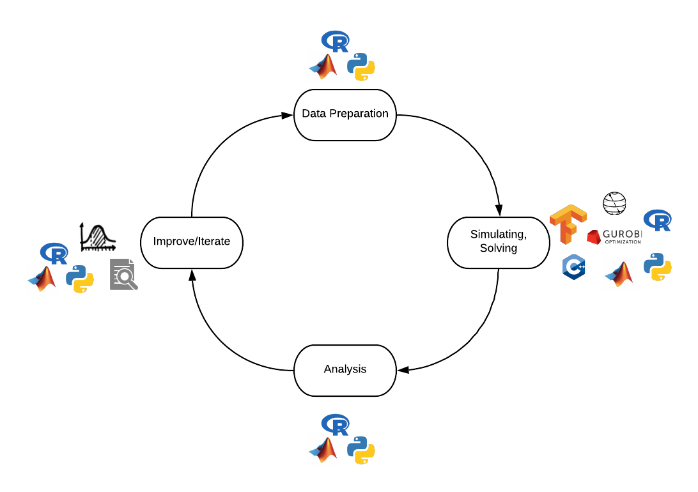
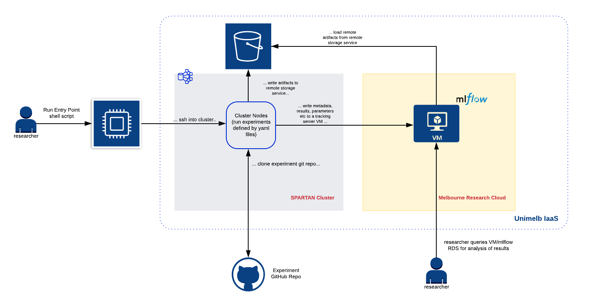
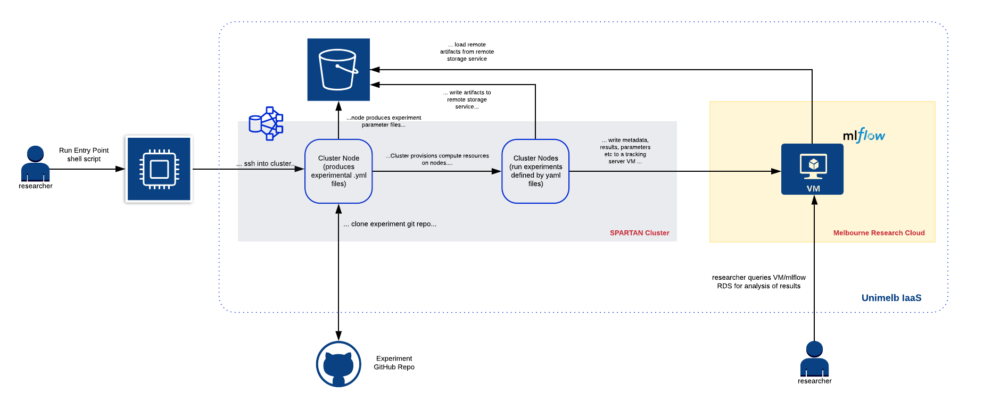

## Slides
- Check out the slides at https://tinyurl.com/scnb3va


## About Me

- Vivek Katial (vkatial@student.unimelb.edu.au)
  - PhD Candidate (Optimisation on Quantum Computers)
  - Data Scientist (3 years)

# Motivation

## Running Experiments and Developing ideas is Complex

```{r echo=FALSE, out.width='100%'}

```

## Issues

1. Data Prep:
    + Want to test many different parameters
2. Simulating,Training, Solving:
    + Track various metrics
    + Use different algorithms or solvers
3. Analysis:
    + Work needs to be reproducible
4. Re-iterate:
    + Need to be able to track parameters, metrics, etc...

- Other issue is that this all needs to **scale**

# Introducing "EZ-EXPERIMENTr"

## Overview

- **EZ-EXPERIMENTr** is a toolkit under-development with the aim to help researchers run automated experiments on an HPC cluster.
- How it works?
    - *SPARTAN* to run heavy-duty experiment code
    - *Melbourne Research Cloud (MRC)* to host server that tracks experiments
    - *Singularity Containers* to make each experimental run fully reproducible
    - *GitHub* to manage and version code
    - `yaml` to configure and specify a run of each experiment
   - *mlflow* to track parameters, metrics at scale

## Cloud Infrastructure

### SPARTAN and MRC

- Spartan is High Performance Computing (HPC) system operated by Research Platform Services (ResPlat) at The University of Melbourne.
- Why?
    - Computing takes too long!
    - Lack of memory and speed

- The Melbourne Research Cloud (MRC) provides Infrastructure-as-a-Service (IaaS) cloud computing to the University of Melbourne researchers.
- Why?
    - Quickly deploy virtual machines
    - Similar to AWS, Microsoft Azure, GCP

## Singularity Containers

- Singularity is a container technology. Essentially a container is a curated collection of resource requirements to run an application.
- Specified by a simple text file which is easily documented and version-controlled through tools like Git. 
- Allow for the reproducibility of entire environments and also make applications portable. 
- Container technologies like Docker are widely used in industry, however often in research environments (where arguably reproducibility is most important) users don't have root access to the computing resources they use (particularly in HPC).
- Singularity is a container-technology designed for use in HPC environments. 

## Example Container

\small
```{bash, eval=FALSE, echo=T}
BootStrap: library
From: ubuntu:16.04

%post
    apt-get -y update
    apt-get -y install fortune lolcat

%environment
    export EXPERIMENT_NAME="example_presentation"

%runscript
    echo "This is an example" 

%labels
    Author 'Vivek Katial'
```
\normalsize

- Check it out at: https://sylabs.io/singularity/


## GitHub
- A version control system designed to keep track of all your changes
- Enables you to revert any changes and go back to a previous state
- Git versions the project not files
- Git enables you to work on many different features simultaneously 

- Check it out at: https://www.github.com/


## YAML

- A recursive acronym for: *YAML Ain't Markup Language*
- Often used in configuration files

\pause
```{r, eval=F, echo=T}
experiment: 
  name: "three-sat"
  author: "vivek"
  tracking-uri: "http://localhost:5000"
  seed: 1032918
```

## MLFlow

- MLFlow is an open-source tool developed in industry to help manage the development life-cycle of R&D projects (in particular machine learning)
- The MLflow Tracking component is an API and UI for logging parameters, code versions, metrics, and output files when running your machine learning code and for later visualizing the results.
- MLflow Tracking lets you log and query experiments using Python, REST, R API, and Java.
- Easily integrates with workflow

- Example: "https://localhost:5000"


## Architecture

```{r echo=FALSE, out.width='100%'}

```

## Concepts

### Experiments and Runs

- The tool is organized around the concept of *experiments* and *runs*. 
- An experiment can be considered the wider project.
    - Each experiment is defined by a **GitHub** repository
- A run is an execution of one-configuration of that experiment. A run consists of:
    - Code Version
    - Parameters
    - Metrics
    - Artifacts

## Define an Experiment

- Each experiment is defined by a text file
- The text file specifies:
    - Where to run the experiment
    - Where to store data
    - Link to source code
- Easy to understand 
\newline

\pause
\tiny
```{r, eval=F, echo=T}
experiment:
  repository: "aqc-three-sat-sim" # GitHub Repostiry
  github_url: "https://github.com/vivekkatial/aqc-three-sat-sim"
  cluster_uri: "/data/cephfs/punim1074/"
  cluster_scratch_dir: "/scratch/punim1074/"
  cluster_provider: "unimelb_SPARTAN"
  singularity_image_uri: "ubuntu@115.146.94.33:aqc-three-sat-sim/portable-image.img"
```
\normalsize

## An example of a run

:::::::::::::: {.columns}
::: {.column width="40%"}
- Each experiment is defined by a text file
- The text file specifies:
    - One run configuration of the experiment
    - Parameters
    - Path to scripts
- Easy to understand
:::
::: {.column width="60%" height="50%"}

\tiny
```{r, eval=F, echo=T}
experiment: 
  name: "three-sat"
  author: "Vivek Katial"
  tracking-uri: "http://<mlflow-server-ip-address>:5000"
  seed: 1032918
  
initialise:
  source: "src/generate-instances.R"
  params:
    n_qubits: "{{n_qubits}}"
    k: "{{k}}"
    n_sat: "{{n_sat}}"
    
build_hamiltonians:
  source: "src/run-time-evolution.R"
  params:
    time_T: "{{time_T}}"
    t_step: "{{t_step}}"
    num_energy_levels: "{{num_energy_levels}}"

results:
  source: "src/produce-plots"
```
\normalsize
:::
::::::::::::::

## Generating Experiments

- Each experiment has a `make-templates` script
- This script generates all configurations of your experiment
    - Based on a yaml file: `params_spec.yml`

\pause
\small
```{r, eval=F, echo=T}
n_qubits:
  1:20
t_step:
  0.01
  0.1
k:
  1:20
```
\normalsize


## Parallelising with SPARTAN

- We now have *many* experimental run configurations
- We build a Singularity Container that specifies all requirements to run the experiment down to an OS-level
- We pass each run configuration as an argument to our Container
\newline
\pause
- `singularity run example-image.img PARAMETER_FILE_NAME.yml`

## Putting it all together

```{r echo=FALSE, out.width='100%'}

```

# Thank You!


