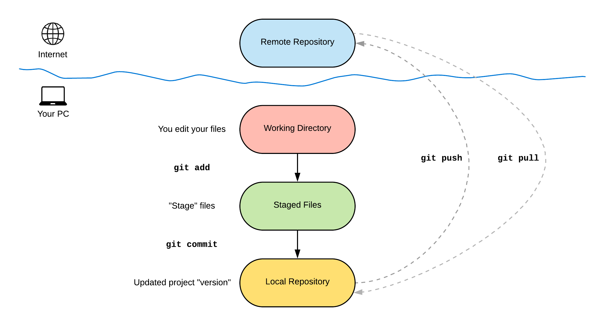

<style type="text/css">
  .reveal ul {
    display: block;
  }
  .reveal ol {
    display: block;
  }
  .reveal code {
    font-family: monospace;
    color: #48e255;
  }
</style>

- Check out the slides at https://tinyurl.com/rpoe9jw

# Introduction

## About Me

- Vivek Katial (vkatial@student.unimelb.edu.au)
  - PhD Candidate (Optimisation on Quantum Computers)
  - Data Scientist (3 years)
- I love travelling and trying new types of food and meeting interesting people


## Agenda

- Getting Started
- Basics
- Branches
- Best Practice

# Getting Started

## Who saves files like this?


## What is version control? Why is it important?

- A system designed to keep track of all your changes
- Designed for collaborative development
- Enables you to know **who** made **what** changes **when**
- Enables you to **revert any changes and go back to a previous state**

## Other Version Control Systems

- Subversion (SVN)
- Mercurial
- Dropbox
- Google Drive


## Why Git?

- Git is **local**:
  - Except pulling and pushing to remote servers
- Git is **fast**
- Git versions the *project* not files
- In Git each version is delibaretly tied to a meaningful change


## Short History of Git

- Git was first created in 2005 by *Linus Torvalds* to aid in Linux Kernel development
- Built for social coding
<br>
<p style="text-align:center;">

</p>

## Short History of Github

- Github is an American company that provides hosting for software development version control using Git
- Github was acquired by Microsoft in 2018 for $7.5 Billion USD
- Git is now industry standard for any software project

## Git Solutions
- Git (Local)
- Github
- Bit Bucket
- **Git Lab** -- Melbourne University has it's own instance

# Basics

## Install git and create GitHub Account

- Check if Git is installed:
  - Command: `$ git --version`
- Linux (Debian)
  - Command: `sudo apt-get install git`
- Linux (Fedora)
  - Command: `sudo yum install git`
- Mac OSX
  - https://git-scm.com/download/mac
- Windows
  - https://git-scm.com/download/windows
  
## Configure Github

```shell
git config --global user.name 'Vivek Katial'
git config --global user.email 'vivekkatial@gmail.com'
git config --global --list
```

## Quick Summary of UNIX/Terminal Commands

- `ls`: List files (`-a` List all files `-h` Human readable) 
- `cd`: Change directory
- `mkdir`: Make directory
- `touch`: Make a file

## Quick Summary of UNIX/Terminal Commands

- `rm`: Remove file (`-i` tag)
- `mv`: Move files (Similar to cut)
- `cp`: Copy files

\newline

- Checkout Meirians Linux Course to learn more

## New Names for things

- Folders are directories
- Main folder is your "repository"

## UNIX Commands Exercise

1. Navigate to your documents directory
2. Create a file called `your_favourite_city.txt`
3. Make a directory called `travel_blog`
4. Move the file you created into the `travel_blog` directory
5. Go into the directory and check  that the file is there on your file browser and command line
6. Delete the directory you just created (**use the -i tag**)


## Creating your own repository!

There are two ways to make your own repository.

1. Locally by running `git init`
2. Online on Github

## Basic summary of Git commands

- `git clone`: Clone a repository into a new directory
- `git status`: Show the working tree status
- `git add`: Stage changes for the commit
- `git commit`: Record changes to the repository
- `git push`: Update remote refs along with associated objects

## Basic Summary  of Git Commands

- `git pull`: Fetch from and integrate with another repository or a local branch
- `git diff`: Show changes between commits
- `git log`: Show commit logs
- Cheat Sheet attached

## Git Workflow



## Git Workflow


## Viewing your commit history
- `git log`

## Working with Remotes

- Let's write a travel blog!

## Git Basics Excercise 1

1. Fork my repository locally: https://github.com/vivekkatial/resplat-github-workshop
2. Clone the forked repository onto your computer
3. Using command line, move into the folder for exercise one. (Otherwise  just use your file browser)
4. Find the bug in my file `travel-blog.md`
5. After finding the bug, fix it and commit it to your forked repository.
6. **Extra for experts:** Find the bug in my python code, fix it and commit my changes

## Git Basics Excercise 2

1. Create a new repository on Github
2. Clone the repository on your local
3. Make a new file "YOUR_NAME.txt"
4. Save this file and **stage**
5. Commit this file
6. Push changes to your Github repository

# Branches


## What is a branch?

- All git commits live within a branch
- There could be many  branches which represent many features
- The main branch in a project is called the **master branch**

## Why Branching?

- Try out an idea - experiment
- Isolate work units - (keeping unfinished work separate)
- Working on long running topics 
- Allow you to share work in progress without altering live/production code

##  Why  Branching?


## Branch Workflow


## Branching Commands

- To create a new branch we run the command:
```shell
git branch <BRANCH_NAME>
```
- To switch to a different branch we run the command:
```shell
git checkout <BRANCH_NAME>
```
- To create a new  branch and switch to it we run the command:
```shell
git checkout -b <BRANCH_NAME>
```

## Branching Commands

- To list all branches:
```shell
git branch -a
```
- To delete a branch
```shell
git branch -d <BRANCH_NAME>
```
- Finally, remember that branches aren't available to others **unless** you push to the *remote*:
```shell
git push origin <BRANCH_NAME>
```

## Branch Merging

- You have now made all your changes and you want to merge changes into master.
```shell
git checkout master
git merge master <BRANCH_NAME>
```

## Pull Requests
- Pull requests are a feature that makes it easier for developers to collaborate using Git
- Once a pull request is sent, stakeholders will review code before deciding to merge.
  - GitHub allows permissions to manage who/who can't merge code into master.
- When making pull requests make sure to write meaningful comments on what features you have worked on

## Merge Conflicts


## Merge Conflicts

- Happen when you merge branches that have competing commits
- Git needs your help to decide which changes to incorporate in the final merge
- Manually fix the changes by looking at your files as text.

## Group Excercise - All of Github

1. One person add other members in group as colloborators to their  forked repository.
2. Each person create a branch on their favourite place  they have travelled too.
3. Inside the HTML file write two sentences about why you love this place.
4. Commit your changes on your respective branch.
5. Merge changes into your master branch.

**Extra for experts change the background colour and add images of each  of your locations**

# Final Notes and Best Practices

## Using a `.gitignore`

You will often find that sometimes you don't want `git` to track everything. These include:

- Passwords
- Tokens/Keys
- Parameter files
- Data
- Log files 
- Cache files

## Commit Messages

- **Why?** Good commit messages help you travel back in time and view what each change meant
- Helps your collobarators understand your changes
- Don't explain how it was done, explain what the intention  was  and **why**
- Use proper english and reference issue identifiers where possible
- If you want to amend a commit message use the following command:
```
git commit -a --amend
```

## README

- A Readme file gives the user (who visits your repository) a brief idea about what the project is about
- Which language it has used, what are the terms and conditions, licensing
- How many forks/stars the repository has got
- What your project can do, screenshots of your running application

The extension .md stands for *Markdown*. Markdown is a lightweight markup language with plain text formatting syntax. It’s a very simple language used to create beautiful and presentable readme files for GitHub.

(PS: These slides were also made in markdown)

## GitLab CICD

- GitLab CI (Continuous Integration): **Builds** and **tests** your code whenever you push. 
- GitLab CD (Continuous Deployment):  Puts the changes of every code in the production which resulting in every day deployment of an application.
- CICD is very powerful and builds testing into your workflow.

## Extra Links

- Github without password: https://help.github.com/en/github/using-git/caching-your-github-password-in-git
- GitLab CICD: https://docs.gitlab.com/ee/ci/
- My Github: https://github.com/vivekkatial

# Thank You!

vkatial@student.unimelb.edu.au


