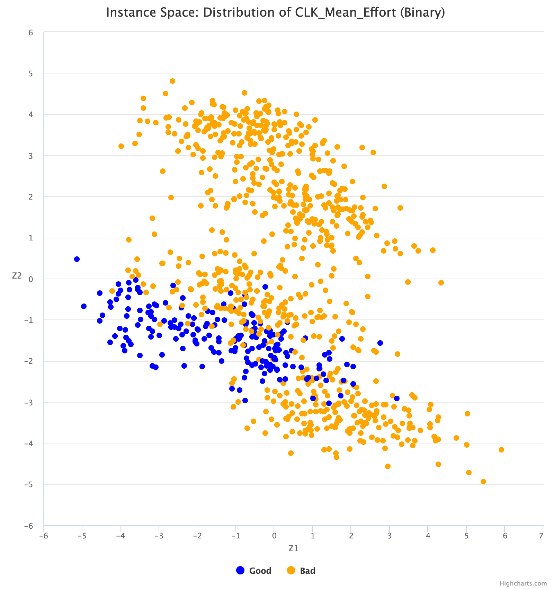

# Introduction

## About Me
- Vivek Katial (vkatial@student.unimelb.edu.au)
  - PhD Candidate (Optimisation on Quantum Computers)

## Talk Structure

- Background
- Proposed Research
- Overview of Literature
- Current Progress
- What's next?

## Main Research Question

- What instances characteristics of optimisation problems make them predisposed to being solved on a Quantum Computer?

# Background

## Adiabatic Quantum Computing (AQC)

>- Adiabatic Quantum Computation is a computational model which relies on the *adiabatic thereom* of quantum mechanics to compute calculations.
>- The famous *Schrödinger Equation* is well-known to describe the time evolution of a quantum state:

>- $$
i\hbar \frac{d}{dt} \ket{\psi (t)} = H(t) \ket{\psi(t)}
$$

>- $\ket{\psi(t)}$ is our state vector, $H(t)$ is the time dependent Hamiltonian. A Hamiltonian of an $n$-qubit system $H(t)$ is given by  $2^n \times 2^n$ matrix.

## Adiabatic Quantum Computing (AQC)

>- An adiabatic computation can be expressed by specifying two Hamiltonians, denoted by $H_B$ and $H_P$ where $H_B$ is our *initial* Hamiltonian and $H_P$ is the *final* or *problem* Hamiltonian.
>- $$\begin{matrix}
  H_B &  \xrightarrow{\hspace*{3cm}} & H_P \\
\ket{\psi_B} &  \text{transform } H(t) &  \ket{\psi_P} \\ 
\text{known state} &  &  \text{unknown}
\end{matrix}
$$
>- Loosely speaking, the adiabatic theorem tells us that if we vary from $H_B$ to $H_P$ *slowly enough* the system will remain in its ground state. This fact is a direct result of the Adiabatic Theorem [@Born1928].


## Adiabatic Quantum Computing (AQC)

>- To conduct the computation we evolve $\ket{\psi(t)}$ till time $t=T$ such that $\ket{\psi(t=T)}$ encodes the answer. The computation is done using a Hamiltonian which linearly interpolates between $H_B$ and $H_P$. Specifically as below:

>- $$
H(t) = \left(1 - \frac{t}{T}\right)H_B + \frac{t}{T}H_P
$$
>- How fast? 
>- $$
 T =  \frac{1}{\min_t  g(t)^2}
$$
>- Where $g(t)$ is the difference between the first two smallest eigenvalues of $H(t)$


## 3SAT (Exact Cover)

>- The satisfiability problem, abbreviated SAT, is a classic example of an NP-complete problem [@Cook1971]
>- The basic SAT formulation can be described as follows: Given a boolean formula (AND $\land$, OR $\lor$ , NOT $\neg$) over $n$ variables ($z_1, z_2, ... , z_n$). Can one set $z_i$'s in a manner such that the Boolean formula is true?
>- A clause is an expression which the variables must satisfy. For example $z_1 \land z_2 \implies z_1 = z_2 = 1$


## 3SAT (Exact Cover Example)

>- Consider a 4-bit number with two clauses:
>    - $z_1 \land z_2  \land z_3$
>    - $z_1 \land z_3  \land z_4$
>- Here we have 16 possible assignments, namely:
>- \begin{align*}
  \mathcal{Z} = \{\,
  & 0000, 0001, 0010, 0011, 0100, 0101, 0110, 0111, \\
  & 1000, 1001, 1010, 1011, 1100, 1101, 1110, 1111 \,\}\enspace
\end{align*}

>- However, our **satisfying assignment** is only $\vec{z} = 1111$

## Mapping 3SAT to AQC

>- How do we construct $H_B$ and $H_P$ so that we can solve our optimisation problem?
>- Farhi et al.[@Farhi2001] describe this construction in considerable detail.
>- We then evolve our system with the following interpolation:
>- $$
H(t) = \left(1 - \frac{t}{T}\right)H_B + \frac{t}{T}H_P
$$
>- Finally, complete measurement and our solution is our final state $\ket{\psi(t=T)}$

## Proposed Research

>- Depending on different structures of instances, classical algorithms may perform differently to Quantum ones.
>- We are looking to investigate which types of instances are more pre-disposed to being solved on Quantum Computers:
>- To do this we have simulated AQC and probe the "quantumness" of each instance:
>    1. Minimum Energy Gap $g_{\text{min}}$
>    2.  Entropy of Entanglement

## Proposed Research

>- This will involve large amounts of generating experimental data
>- To survey the instances we will deploy the instance space analysis methodology [@Smith-Miles2015; @Smith-Miles2012; @Smith-Miles2014] 
>- Ultimately, we can build a prediction model which maps instance features of different 3SAT instances to their inherent "Quantumness"

## Proposed Research

>- Given that we have access to IBM's Quantum Computer, we can also use this approach on QAOA and produce results from a *universal quantum computer*.
>- This methodology can then be further extended to other optimisation problems that can be mapped to Quadratic Unconstrained Binary Optimisation (QUBO) problems.

## Algorithm Selection

>- Given a set of problem instances, predicting which algorithm is most likely to best perform was first explored by Rice [@Rice1976].
\pause
```{r echo=FALSE, out.width='60%', fig.align='center'}
knitr::include_graphics('./rices-framework-for-algorithm-selection.png')
```
>- However, what we are interested in is probing the strengths and weaknesses of AQC for different instances of SAT.

## Instance Space Methodology

>- The instance space methodology presented in [@Smith-Miles2015; @Smith-Miles2012; @Smith-Miles2014] extends Rice's framework.
\pause
```{r echo=FALSE, out.width='60%', fig.align='center'}
knitr::include_graphics('./instance-space-methodology.png')
```

## Instance Space Methodology

```{r echo=FALSE, out.width='60%', fig.align='center'}

```

## Instance Space Methodology

```{r echo=FALSE, out.width='60%', fig.align='center'}
knitr::include_graphics('./Performance-distribution.png')
```

## Hardness Features for 3SAT

>- Selman et. al demonstrated [@Selman1996] the existence of a phase transition for random 3SAT problems.
>- SATZilla and Nudelman et. al have identified 84 different features for SAT instances [@Xu2008; @Nudelman2004].

\pause
:::::::::::::: {.columns}
::: {.column width="50%"}
\small
1. Problem Size Features
2. Variable-Clause Graph Features
3. Variable Graph Features
4. Clause Graph Features
5. Proximity to Horn Formula
:::
::: {.column width="50%"}
\pause
\small
6. Balance Features
7. DPLL Probing Features
8. Local Search Probing Features
9. LP-Based Features
:::
::::::::::::::

## Quantum Computing Research into Hard SAT problems

>- In their seminal paper [@Farhi2001] Farhi et al. aswell as Hogg et al. [@Hogg2002] touched on the phase transition and showed that the minimum energy gap perhaps scaled polynomially with $n$ as roughly $N^2$.
>- However in 2009,  Young et al [@Young2009]. demonstrated via monte-carlo simulations of $N=256$ that some USA instances have a *quantum phase transition*.
>- Their research indicated that as $N \rightarrow \infty$ the system is expected to lead to an exponentially small gap, and
hence an exponential complexity.
>- Farhi et al. [@Farhi2009] also investigated different evolution paths and their results suggested it is possible to overcome the exponentially small minimum gap by selecting random initial Hamiltonians

## Quantum Computing Research into Hard SAT problems

>- Latorre et al. probed the entropy of entanglement for 250 USA Instances of Exact-Cover [@Latorre2004], their results showed that entropy of entanglement scales linearly with $N$.
>- However, their results also showed that for large $N$, the minimum gap scaling is exponential and can be associated with a *quantum phase transition* [@Latorre2004].
>- Hauke et al. [@Hauke2015] ran simulations of adiabatic quantum optimisation with $n=16$. Their results indicated  that large entanglement entropy has little significance for the
success probability of the optimisation task.

## Quantum Computing Research into Hard SAT problems

>- Choi et al. [@Choi2020] showed that problem Hamiltonian parameters can affect the minimum spectral gap of AQC.
>- Gabor et al. [@Gabor2019] shows that the phase transition from 3SAT persists in some form (but possibly to a lesser extent) in AQC via **real experimental results** on D-WAVE.
>- Most signficant for us is that none of this work approaches instances in a robust manner such as the MATILDA framework

## Current Progress

>1. Learning Quantum Mechanics and Quantum Computing
>2. Conducting literature review on current advances in Adiabatic Quantum Computing.
>3. Developed working environment, set up GitHub, scripts, organizational tools enabling an efficient working environment.

## Current Progress

>4. Developed an architecture to run reproducible experiments at scale
>5. Provisioned all infrastructure required for above on Melbourne Research Cloud and SPARTAN
>6. Developed a working implementation of Adiabatic Quantum Computing on different instances of 3SAT.

## Next Steps (untill Confirmation)

>1. Complete Literature Review of current advances in AQC.
>2. Implement scripts to generate **hard** instances of 3SAT with respect to *instance characteristics*.
>3. Apply Instance Space Methodology from MATILDA to find decision boundaries for *Entanglement Entropy* and *Minimum Energy Gap*

## Next Steps (untill Confirmation)

>4. Extend implementation to work on QAOA and VQE with `QisKit`
>5. Learn C++ effectively, this will be required when implementing larger simulations. 
>6. Apply Tensor Network methodology on current simulations
>7. Further advance knowledge of Quantum Physics (possibly through taking a course in Quantum Computing)
>8. Extend research to look at other optimisation problems


# References

## References {.allowframebreaks}
\small
