# Introduction

## About Me
- Vivek Katial (vkatial@student.unimelb.edu.au)
  - PhD Candidate in School of Mathematics and Statistics

## Talk Structure

- Background
- Overview of Literature
- Current Progress
- What's next?

## Main Research Question

- What instances characteristics of optimisation problems make them predisposed to being solved on a Quantum Computer?

# Adiabatic Quantum Computing (AQC)

## Adiabatic Quantum Computing (AQC)

>- Adiabatic Quantum Computation is a computational model which relies on the *adiabatic thereom* of quantum mechanics to compute calculations.
>- The famous *Schrödinger Equation* is well-known to describe the time evolution of a quantum state:

>- $$
i\hbar \frac{d}{dt} \ket{\psi (t)} = H(t) \ket{\psi(t)}
$$

>- $\ket{\psi(t)}$ is our state vector, $H(t)$ is the time dependent Hamiltonian. A Hamiltonian of an $n$-qubit system $H(t)$ is given by  $2^n \times 2^n$ matrix.

## Adiabatic Quantum Computing (AQC)

>- An adiabatic computation can be expressed by specifying two Hamiltonians, denoted by $H_B$ and $H_P$ where $H_B$ is our *initial* Hamiltonian and $H_P$ is the *final* or *problem* Hamiltonian.
>- $$\begin{matrix}
  H_B &  \xrightarrow{\hspace*{3cm}} & H_P \\
\ket{\psi_B} &  \text{transform } H(t) &  \ket{\psi_P} \\ 
\text{known state} &  &  \text{unknown}
\end{matrix}
$$
>- Loosely speaking, the adiabatic theorem tells us that if we vary from $H_B$ to $H_P$ *slowly enough* the system will remain in its ground state. This fact is a direct result of the Adiabatic Theorem [@Born1928].


## Adiabatic Quantum Computing (AQC)

>- To conduct the computation we evolve $\ket{\psi(t)}$ till time $t=T$ such that $\ket{\psi(t=T)}$ encodes the answer. The computation is done using a Hamiltonian which interpolates between $H_B$ and $H_P$. Specifically as below:

>- $$
    H(t) = \left[1 - \lambda(t)\right]H_B + \lambda(t)H_P, \qquad \lambda (t) = \frac{t}{T}
$$
>- How fast? 
>- $$
 T =  \frac{1}{\min_t  g(t)^2}
$$
>- Where $g(t)$ is the difference between the first two smallest eigenvalues of $H(t)$


# 3SAT - Exact Cover

## 3SAT (Exact Cover)

>- The satisfiability problem, abbreviated SAT, is a classic example of an NP-complete problem [@Cook1971]
>- The basic SAT formulation can be described as follows: Given a boolean formula (AND $\land$, OR $\lor$ , NOT $\neg$) over $n$ variables ($z_1, z_2, ... , z_n$). Can one set $z_i$'s in a manner such that the Boolean formula is true?
>- A clause is an expression which the variables must satisfy. For example $z_1 \land z_2 \implies z_1 = z_2 = 1$


## 3SAT (Exact Cover Example)

>- Consider a 4-bit number with two clauses:
>    - $z_1 \land z_2  \land z_3$
>    - $z_1 \land z_3  \land z_4$
>- Here we have 16 possible assignments, namely:
>- \begin{align*}
  \mathcal{Z} = \{\,
  & 0000, 0001, 0010, 0011, 0100, 0101, 0110, 0111, \\
  & 1000, 1001, 1010, 1011, 1100, 1101, 1110, 1111 \,\}\enspace
\end{align*}

>- However, our **satisfying assignment** is only $\vec{z} = 1111$
>- We call a 3SAT problem with one satisfying assignment an instance of USA
>- Exact Cover implies that clauses are "exclusive" and in the form of $z_i + z_j + z_k = 1$

## Mapping 3SAT to AQC

>- How do we construct $H_B$ and $H_P$ so that we can solve our optimisation problem?
>- Farhi et al.[@Farhi2001] describe this construction in considerable detail.
>- We then evolve our system with the following interpolation:
>- $$
    H(t) = \left[1 - \lambda(t)\right]H_B + \lambda(t)H_P, \qquad \lambda (t) = \frac{t}{T}
$$
>- Finally, complete measurement and our solution is our final state $\ket{\psi(t=T)}$

# Instance Space Analysis

## Algorithm Selection

>- Given a set of problem instances, predicting which algorithm is most likely to best perform was first explored by Rice [@Rice1976].
\pause
```{r echo=FALSE, out.width='60%', fig.align='center'}
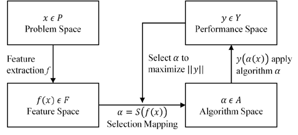
```
>- However, what we are interested in is probing the strengths and weaknesses of AQC for different instances of SAT.

## Instance Space Methodology

>- The instance space methodology presented in [@Smith-Miles2015; @Smith-Miles2012; @Smith-Miles2014] extends Rice's framework.
\pause
```{r echo=FALSE, out.width='60%', fig.align='center'}
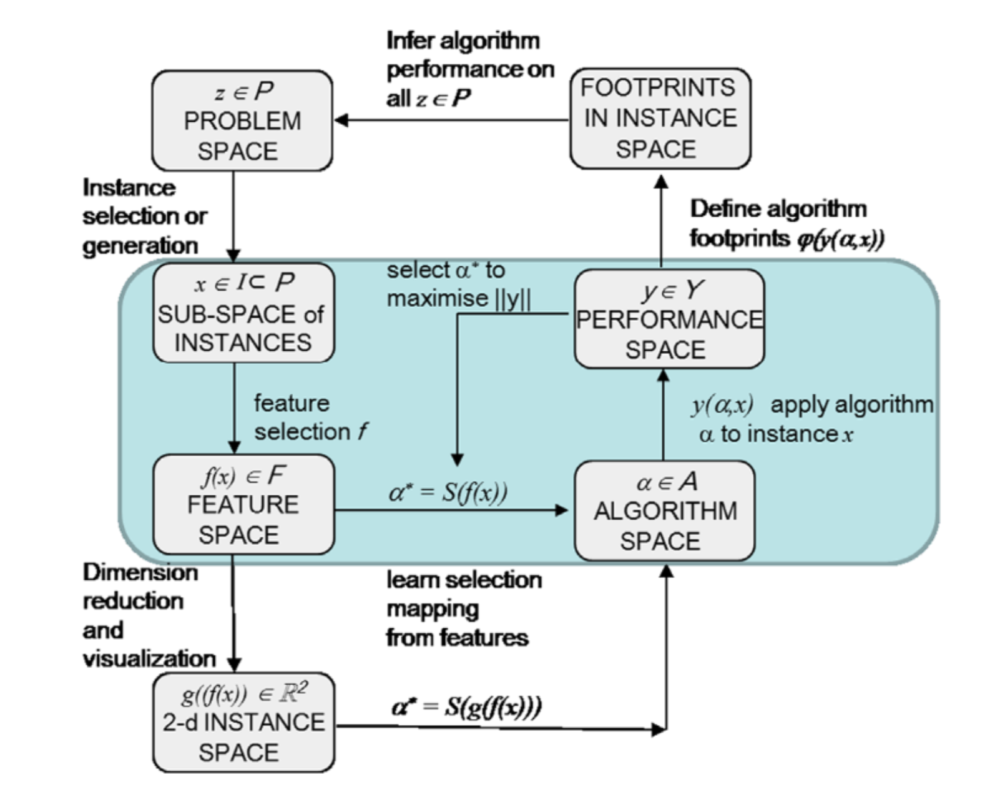
```

# Current Literature

## Quantum Computing Research into Hard SAT problems

>- In their seminal paper [@Farhi2001] Farhi et al. aswell as Hogg et al. [@Hogg2002] touched on the phase transition and showed that the minimum energy gap perhaps scaled polynomially with $n$ as roughly $N^2$.
>- However in 2009,  Young et al [@Young2009]. demonstrated via  Quantum monte-carlo simulations of $N=256$ that some USA instances have a *quantum phase transition*.
>- Their research indicated that as $N \rightarrow \infty$ the system is expected to lead to an exponentially small gap, and hence an exponential complexity.
>- Farhi et al. [@Farhi2009] also investigated different evolution paths and their results suggested it is possible to overcome the exponentially small minimum gap by selecting random initial Hamiltonians

## Quantum Computing Research into Hard SAT problems

>- Latorre et al. probed the entropy of entanglement for 250 USA Instances of Exact-Cover [@Latorre2004], their results showed that entropy of entanglement scales linearly with $N$.
>- However, their results also showed that for large $N$, the minimum gap scaling is exponential and can be associated with a *quantum phase transition* [@Latorre2004].
>- Hauke et al. [@Hauke2015] ran simulations of adiabatic quantum optimisation with $n=16$. Their results indicated  that large entanglement entropy has little significance for the
success probability of the optimisation task.

## Quantum Computing Research into Hard SAT problems (D-Wave)

>- Mapping optimisation problems as QUBO problems unlocks a significant number of NP-complete problems to investigate [@Lucas2014]
>- Katzgrabber et al. [@Mandra2017] found Quantum annealing performed slightly better than classical ML algorithms on a computational biology problem
>- Gabor et al. [@Gabor2019] shows that the phase transition from 3SAT persists in some form (but possibly to a lesser extent) in AQC via **real experimental results** on D-WAVE.
>- Other promising studies in election forecasting and human cancer detection [@Li2019,@Henderson2019,@Inoue2020].
>- Current approaches fail to investigate a suitable class of instances.


# Research Overview

## Research Overview 

>- Depending on different structures of instances, classical algorithms may perform differently to Quantum ones.
>- We are looking to investigate which types of instances are more pre-disposed to being solved on Quantum Computers. Currently, we have explored two types of instances:
>    - Relaxed USA Instances
>    - Generalised USA Instances

## Research Overview 

>- We then have simulated AQC and probe the "quantumness" of each instance by measuring:
>    1. Minimum Energy Gap $g_{\text{min}}$
>    2. Bipartite Entropy of Entanglement
>    3. Probability of sucess after a fixed run time $T$

## Research Overview - Instance Space 

>- The problem space $\mathcal{P}$ consists of all possible 3SAT instances of Exact Cover.
>- The instance space $\mathcal{I} \subset \mathcal{P}$ compromises of 5760 RUSA and GUSA instances. These range from 5 to 11 qubits and are randomly generated.
>- The feature space $\mathcal{F}$ consists of 23 different instance features generated
>- The algorithm portfolio $\mathcal{A}$ includes 16 algorithm parameter configurations for the run time $T$ and also the time step $\Delta t$. We also are using a single path function $\lambda(t)$ 
>- The performance metric $y \in \mathcal{Y}$ is the probability of success for the algorithm. 


## Research Overview - Generating GUSA Instances
\begin{algorithm}[H]
\SetAlgoLined
 Fix number of bits to $n$\;
 $C=\{\}$\;
 $i=0$\;
 \While{While number of satisfying assignments $> 0$}{
  $C_i$ = Three distinct bits randomly from a uniform distribution\;
  $i = i + 1$\;
  \uIf{number of satisfying assignments $= 1$ }{
  \textbf{return} $(n, \mathbf{C})$\;
  } \uElseIf{number of satisfying assignments = 0}{
    \textbf{restart}\;
    }
    \uElseIf{number of satisfying assignments has decreased}{
    Add $C_i$ into $\mathbf{C}$ \;
  }
 }
 \KwResult{$(n, \mathbf{C})$: $n$ variables with a set of clauses $\mathbf{C}$ }
 \caption{Generalised USA Instances}
 \label{alg:gusa}
\end{algorithm}

## Research Overview - Generating RUSA Instances

\begin{algorithm}[H]
\SetAlgoLined
 Fix number of bits to $n$\;
 $C=\{\}$\;
 $i=0$\;
 \While{While number of satisfying assignments $> 0$}{
  $C_i$ = Three distinct bits randomly from a uniform distribution\;
  $i = i + 1$\;
  \uIf{number of satisfying assignments $= 1$ }{
  \textbf{return} $(n, \mathbf{C})$\;
  } \uElseIf{number of satisfying assignments = 0}{
    \textbf{restart}\;
    }
    \Else{
    Add $C_i$ into $\mathbf{C}$ \;
  }
 }
 \KwResult{$(n, \mathbf{C})$: $n$ variables with a set of clauses $\mathbf{C}$ }
 \caption{Relaxed USA Instances}
 \label{alg:rusa}
\end{algorithm}

## Research Overview - $f(x)$ Instance Characterstics

\begin{table}[h!]
\scalebox{0.8}{\begin{tabular}{ll}
\hline
\textbf{Feature Group} & \textbf{Feature}                                                                     \\ \hline
Problem Size           & Number of variables: $n$                                                             \\
                       & Number of clauses: $m$                                                               \\
                       & Clause-to-Variable Ratio: $\frac{n}{m}$, $\frac{n}{m}^{2}$,$\frac{n}{m}^{3}$         \\
                       & Inverse Clause-to-Variable Ratio: $\frac{m}{n}$, $\frac{m}{n}^{2}$,$\frac{m}{n}^{3}$ \\
                       & Linearised Clause to Variable Ratio: $|4.26 - \frac{n}{m}|, |4.26 - \frac{n}{m}|^2$, \\
                       & $|4.26 - \frac{n}{m}|^3$                                                             \\ 
                       &                                                                                      \\ \hline
Variable Clause Graph  & Variable Node Degree:  mean, median, min, max                                        \\
                       & Clause Node Degree :  mean, median, min, max                                         \\
                       &                                                                                      \\ \hline
Variable Graph  &  Node Degree :  mean, median, min, max                                                      \\
                       &                                                                                      \\ \hline
\end{tabular}}
\caption{Instance Features for 3SAT Exact Cover}
\label{table:instance-features}
\end{table}

## Research Overview - Distribution of Features
```{r echo=FALSE, out.width='100%', fig.align='center'}
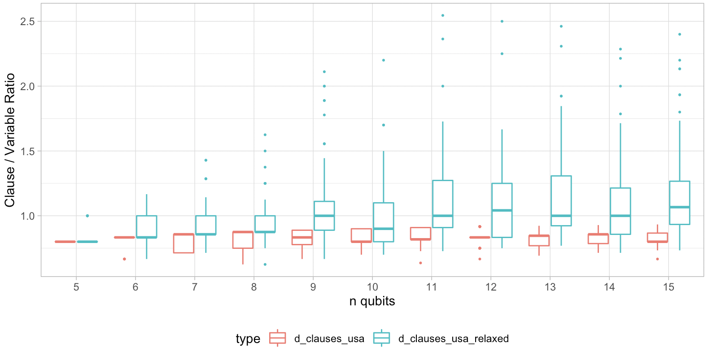
```

## Research Overview - Distribution of Features
```{r echo=FALSE, out.width='100%', fig.align='center'}
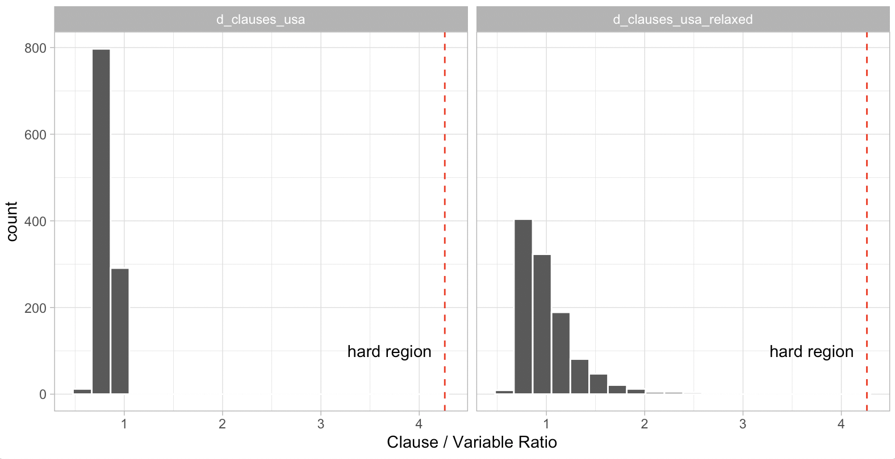
```

# Results

## Research Overview - Results 
```{r echo=FALSE, out.width='100%', fig.align='center'}
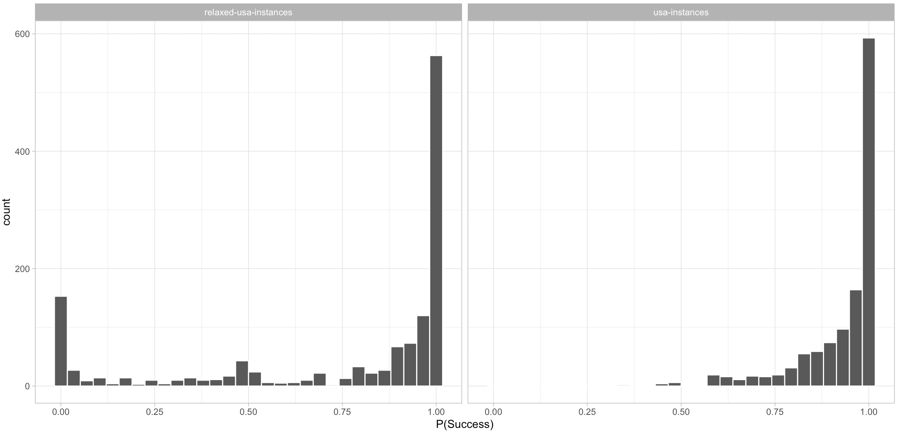
```

## Research Overview - Results 
```{r echo=FALSE, out.width='100%', fig.align='center'}
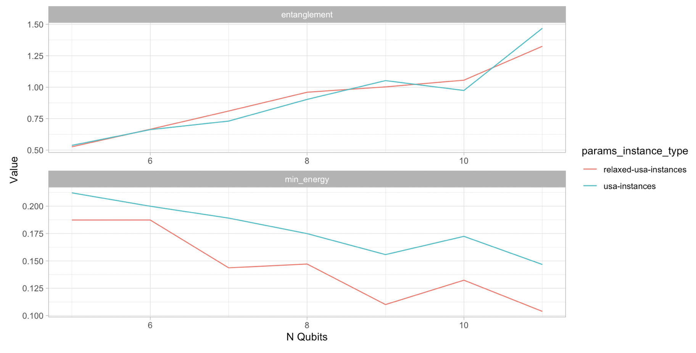
```
## Research Overview - Results 
```{r echo=FALSE, out.width='100%', fig.align='center'}
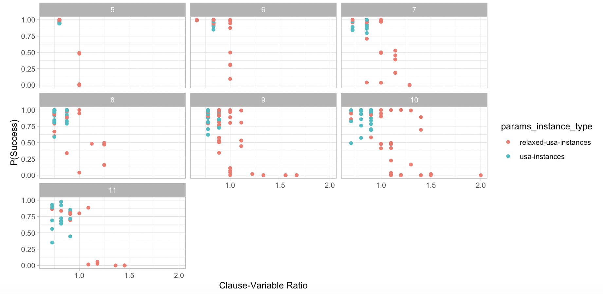
```

## Research Overview - Entropy
```{r echo=FALSE, out.width='100%', fig.align='center'}
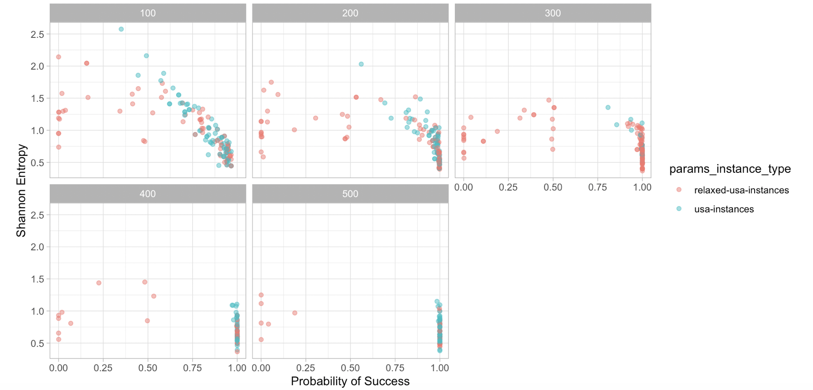
```

## Research Overview - Minimum Energy Gap
```{r echo=FALSE, out.width='100%', fig.align='center'}
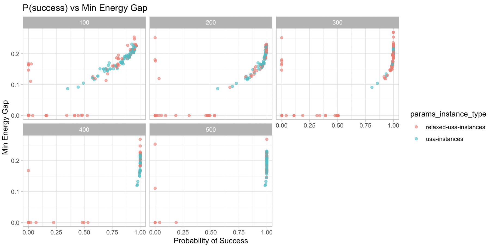
```

## Research Overview - Results 
```{r echo=FALSE, out.width='50%', fig.align='center'}
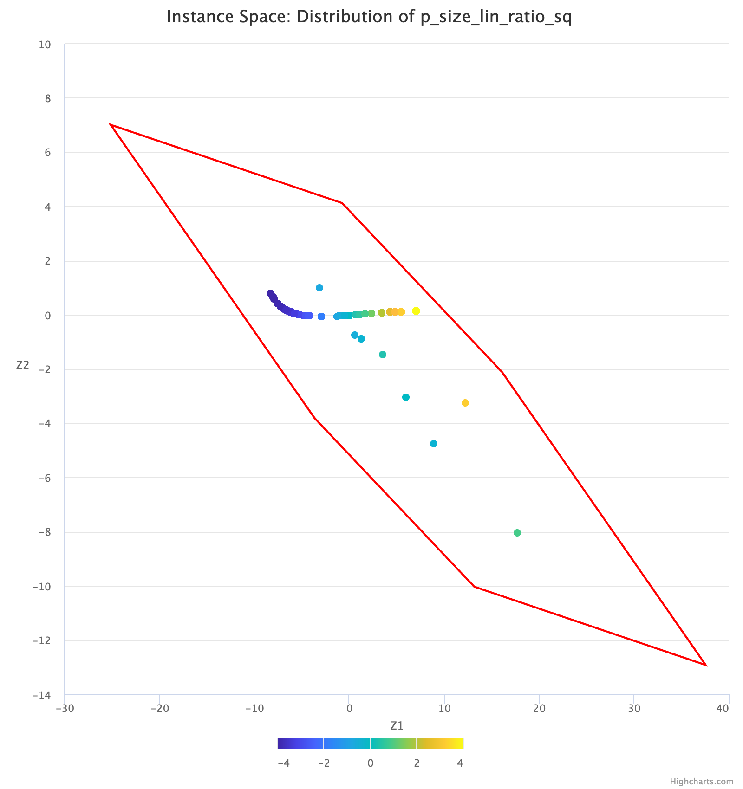
```

## Research Overview - Results
- We set a threshold $\tau=0.95$ for "good" or easy instances.
```{r echo=FALSE, out.width='50%', fig.align='center'}
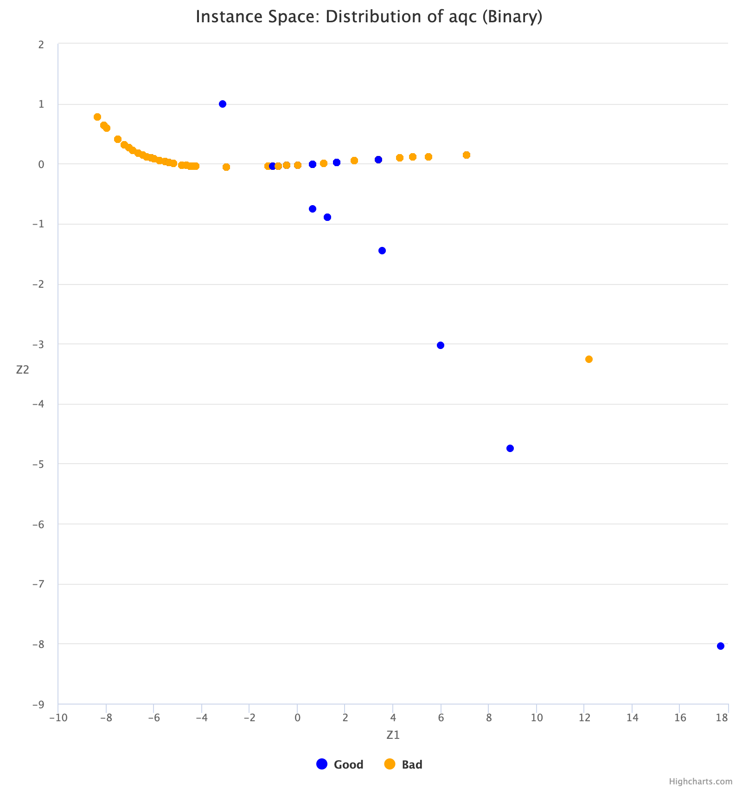
```

# Next Steps

## Next Steps
>1. Generate more instances based on MATILDA results
>2. Implement more performance metrics on experiments
>3. Identify which time step $\Delta t$ is most suitable for evolution
>4. Investigate the effects of randomising initial Hamiltonians

## Next Steps
>5. Explore QMC and Matrix-Product States to elicit further insights about AQC
>6. Extend implementation to work on QAOA and VQE with `QisKit`
>7. Apply ISA to results from QAOA and run QAOA on Universal Quantum Computer 
>8. Extend research to look at other QUBO problems


# References

## References {.allowframebreaks}
\small
