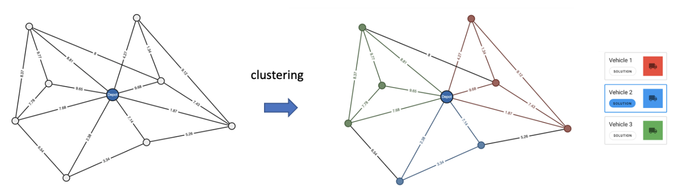

## Background
  - Developing a framework to robustly evaluate quantum algorithms using Instance Space Analysis
  - Explore the tools needed to develop Quantum Algorithms:
      - Adiabatic  Quantum Algorithms (year 1)
      - Universal Gate Based Quantum Algorithms (year 2)
  - Other things:
      - System to scale experiments
      - 2 talks with the MATILDA group on my work 
      - ADF Project and Exhibition in Brisbane for QAOA and VRP
        
## Optimisation Problems
- Constraint Satisfaction (3SAT)
- Traveling Sales Person (TSP)
- Vehicle Routing (VRP)
    
## Quantum Performance
  - How do we evaluate success when analysing quantum algorithms?
    - Classical Performance vs Quantum Performance
    - Comparing different Quantum Algorithms
    - Minimising the use of quantum resource to achieve a certain success probability

## Solving Optimisation Problems using a Quantum Computer
- Different Quantum Algorithms explored:
  - Adiabatic Quantum Computing (Quantum Annealing)
  - Quantum Approximate Optimisation Algorithm (QAOA)
  - Variational Quantum Eigensolver (VQE)
  
## Quantum Algorithms 
- AQC developed an implementation to simulate using `R`
- QAOA leveraging IBM `qiskit` -- a Python package 
- VQE leveraging IBM `qiskit`
- Using Matrix-Product states (MPS) to reduce memory burden

## Example VRP Instance

## Example VRP problem formulated with QAOA

## Types of instances investigated

- Complete random graphs
- Watts-strotgatz
- Euclidean TSPs
- Euclidean TSPs with outliers
- Asymettric TSPs

## Graph Features

## TSP Features

## Results

## Results

 

## Thesis Outline
- [Thesis Structure](#thesis-structure)
  - [Introduction](#introduction)
  - [Solving Optimisation Problems using a Quantum Computer](#solving-optimisation-problems-using-a-quantum-computer)
  - [Features and Algorithm Performance of Quantum Algorithms](#features-and-algorithm-performance-of-quantum-algorithms)
  - [Instance Space Analysis](#instance-space-analysis)
  - [Frameworks for Evaulating Quantum Algorithms / Discussion](#frameworks-for-evaulating-quantum-algorithms--discussion)
  - [Evaulation of Other Optimisation Algorithms](#evaulation-of-other-optimisation-algorithms)
  - [Conclusion](#conclusion)
  
## Discuss thesis outline
- Here is a link to the [thesis outline](https://github.com/vivekkatial/fantastic-enigma/blob/master/thesis/thesis-structure.md)

# Any Questions?

