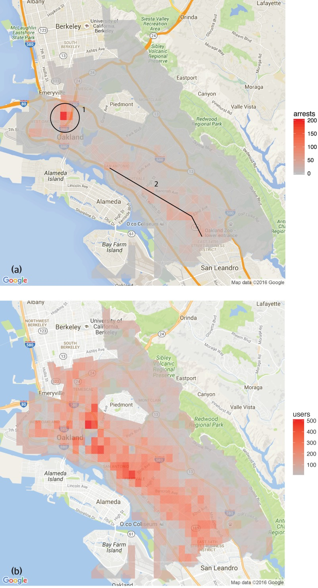
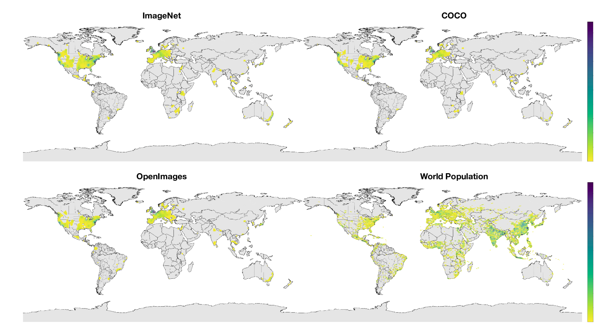
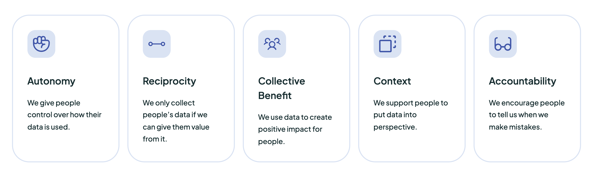

- Check out the slides at https://vivekkatial.github.io/vk-presentations/#/

# Introduction

## About Me

>- Disclaimer: **I am not an expert in ethics and philosophy**
>- Vivek Katial (vivek@multitudes.co)
>  - Data & Founding Team @ [Multitudes](https://www.multitudes.co/)
>  - Co-founder and Executive Director @ [Good Data Institute](https://www.gooddatainstitute.com/)
>  - PhD Candidate @ Unimelb (Optimisation on Quantum Computers)
>  - Visiting PhD Researcher @ NASA Jet Propulsion lab
>- I love traveling and trying new types of food and meeting interesting people

## About Me

## Why do we need to consider ethics in Data Science?

## What are / is ethics?

>- The word “Ethics” is derived from the Greek word Ethos, meaning habit or custom. 
>- Ethics help us distinguish between right and wrong.
>- Many schools of thoughts that philosophers have argued over for centuries.
>- We are going to assume that whatever there is social consensus on today, is our view on ethics.

## Why do we need to consider ethics when building data proucts?

>- Fastest growing industry, expected to continue
>- Often undesirable consequence can occur. Especially in relation to, privacy, fairness, etc.
>- Considering *ethics* provides us a framework to decide what is "OK" to do

# Algorithimic Bias

## Algorithimic Bias -- what is it?

>- Algorithmic bias refers to the ability of algorithms to systematically and repeatedly produce outcomes that benefit one particular group over another
>- Already many examples in society where algorithms have harmed marginalized groups  

## Trivial Example

>- Predictions on the image of the Western bride included labels such as “bride”, “wedding”, “ceremony”
>- For the woman wearing a traditional Indian wedding dress, the predicted labels were “costume”, “performing arts”, “event

## More Harmful Example

> 
[@Lum2016]

# The Machine Learning Lifecycle

# Data Collection

>- We collect, label and prepare data for modelling and analysis purposes.
>- Issues arise when the data collected doesn't fully reflect the real world

## How can bias arise?

[@Devries2019]

## How can we mitigate this?

>- Ensure that the data is collected in a manner that reflects reality.
>- Historical data is collected from a society in which **systems of oppression operate**, you might even want to over/under-sample data from marginalized groups in order to move towards more equitable datasets.
>- Facial recognition - fewer BIPOC photos, over sample to have parity with population.
>- A fantastic resource to learn more about equitable data collection practices is Timnit Gebru’s article ["Datasheets for Datasets"](https://arxiv.org/abs/1803.09010).

 [@Gebru2021]

# Feature Engineering & Selection

>- A feature is simply a characteristic of each data point that might help for the purposes of prediction. 
>- For house price prediction, **number of rooms** or **post-code**

## How can bias arise?

>- Consider a model that predicts whether a police officer should be deployed in a particular suburb based on past incarceration data
>- A data scientist may claim to have built a model which is “socially neutral” as they have removed all features that correspond to race, age, and gender.
>- Other features like postal code might also correlate with features such as race (because in the real world, suburbs are segregated by race)
>- Studies demonstrate the potential for predictive policing to propagate and exacerbate racial biases in law enforcement.

[@Lum2016]

## How can we mitigate it

>- Despite removing features about race, age and gender in the modelling process, one should still look for other features (such as postcode) that correlate with demographic features
>- The easiest counter-measure is to critically examine the relationships between features that may correlate

## Deep Learning -- can get trickier

>- Neural Networks can construct latent features which can learn non-linear and complex biases.
>- You can use things like `SHAP` and `LIME` to asses the influence of demographic variables on model performance.

[@Lundberg2017]

## Test the Bias and Fairness of your model

>- Consider a basic classifier example
>- A classifiers output decision should be the **same across sensitive charactersitics**
>- Our classifier $f(\vec{x})$ is considered **biased** if the decision changes after being exposed to an additional sensitive feature (e.g. race, gender).

## Test Bias and Fairness

Consider a binary variable for gender, $z$ then:

$$
  f(\vec{x}) = f(\vec{x}, z)
$$

This means:  $P(\hat{y} = 1 | z = 0, y = 1) = P(\hat{y} = 1 | z = 1, y = 1)$

# Other cool fancier techniques

>- [Adversarial Multi-Task Learning](https://aclanthology.org/P17-1001.pdf) -- the model learns both the target, $y$ and the sensitive attribute $z$
>    - The cost function defined in the model negates the gradient for the sensitive feature
>    - This is done to remove the effect of $z$ on the prediction of $y$
>- Generative Models can be used to uncover latent variables that have biases -- Adaptive Resampling is a technique discussed by [Amini et al.](https://dl.acm.org/doi/pdf/10.1145/3306618.3314243)

[@Shuang2020]

# Model Evaluation

>- This involves assessing the accuracy of a model’s ability to predict a certain outcome – for example correctly predicting a person’s face in a facial recognition system. 

## Intersectionality

"Intersectionality means that people can be subject to multiple, overlapping forms of oppression, which interact and intersect with each other."- Kimberly Crenshaw

## How can bias arise?
>- Companies who were selling facial recognition technologies that boasted accuracies of up to 90% (IBM, Google, Face++)
>- 

[@Buolamwini2018]

## How can we mitigate it

>- Intersectional model analysis as a tool to assess model accuracy, inspired by the sociological framework of intersectionality
>- It's necessary for Data Scientists to advocate for measures of model performance that contain results that cover all demographics
>- [Model Cards for Model Reporting by Mitchell et al.](https://arxiv.org/abs/1810.03993) is a great resource

[@Mitchell2019]

## How can we mitigate it

## How can we mitigate it

# Model Interpretation and Explainability

Model explainability is a concept which looks into the ability to understand the results of a machine learning model. 

## How can bias arise?

In 2007 a teacher was fired from a Washington DC school due to an algorithm: Despite having highly favourable reviews from students and parents, an opaque algorithm was used to determine her performance as being in the bottom 2% of all teachers. 

## How can we mitigate it

>- When humans interact with ML systems it is imperative they understand exactly how and what personal data will be used and also why a model is being used in the first place. 
>- Product managers, software developers, and designers should have a high-level understanding of the ML system they are building
>- Many tools available to help understand model behaviour such as SHAP (SHapley Additive exPlanations), which allows for an understanding of the effect of different model features, or LIME is another tool for evaluating black-box techniques

[@Ribeiro2016]

# Model Deployment

Woohoo! We’ve trained up a model, evaluated that it is working effectively, and completed the R&D process, our models are then deployed into production.

## How can bias arise?

>- We can introduce bias into a model because there are inconsistencies between the problem a model was built to solve and the way it is used in the real world. 
>- For example, Microsoft’s NLP bot learnt racial slurs in less than 24 hours of being exposed to Twitter
>- Another issue is that data in production drifts over time – a phenomenon known as concept drift.

## How can we mitigate it

>- Setup monitoring and consistently track the quality of input data
>- Especially in continous learning systems the distribution of the input data can revert to becoming more biased -- even if you did all the hard work in data collection
>- Compare the distribution of new input data from production with the training data used in model development
>- Track, label, version, and date the models being used in production so it is easy to roll back and even switch off models that are performing poorly.

# Applying this at Multitudes

## Data Ethics Principles

# Tips for starting off!

>- Create some data principles
>- This is a well-studied field. Get buy-in from leadership using existing research
>- Conduct a **bad actor exercise**
>- Make data labelling fun and diverse
>- Recognise that humans are the ones who create algorithms, so we also recognize the importance of the broader culture and environment we create and operate in.
>- Commit to learning more!

## Conclusions

>- Follow AI Best practices
  >- Dataset Docs (Gebru 2018), AJL
  >- Model Reporting and Curation
  >- Transparency and reproducibility
>- R&D in algorithm research

## Extra Links / Resources
- [Robert McDaniel](https://www.theverge.com/22444020/chicago-pd-predictive-policing-heat-list)
- [Making a racist AI](http://blog.conceptnet.io/posts/2017/how-to-make-a-racist-ai-without-really-trying/)
- [Coursera MOOC on Data Ethics](https://www.coursera.org/learn/data-science-ethics)
- [Automating Inequality](https://us.macmillan.com/books/9781250074317/automatinginequality)

# Thank You!

vivek@multitudes.co

# References
