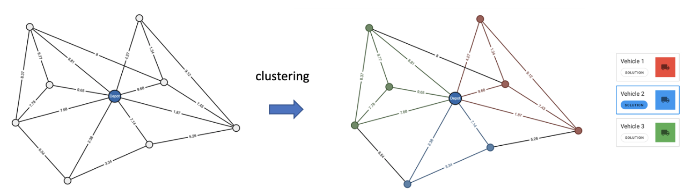
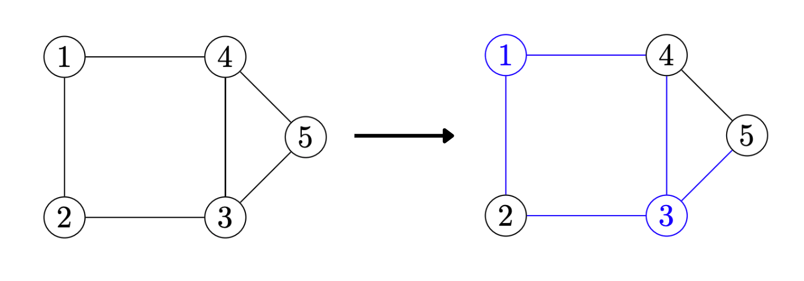
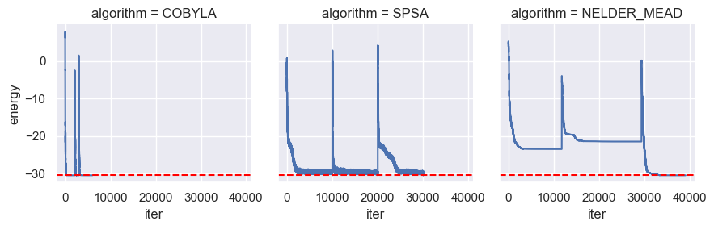
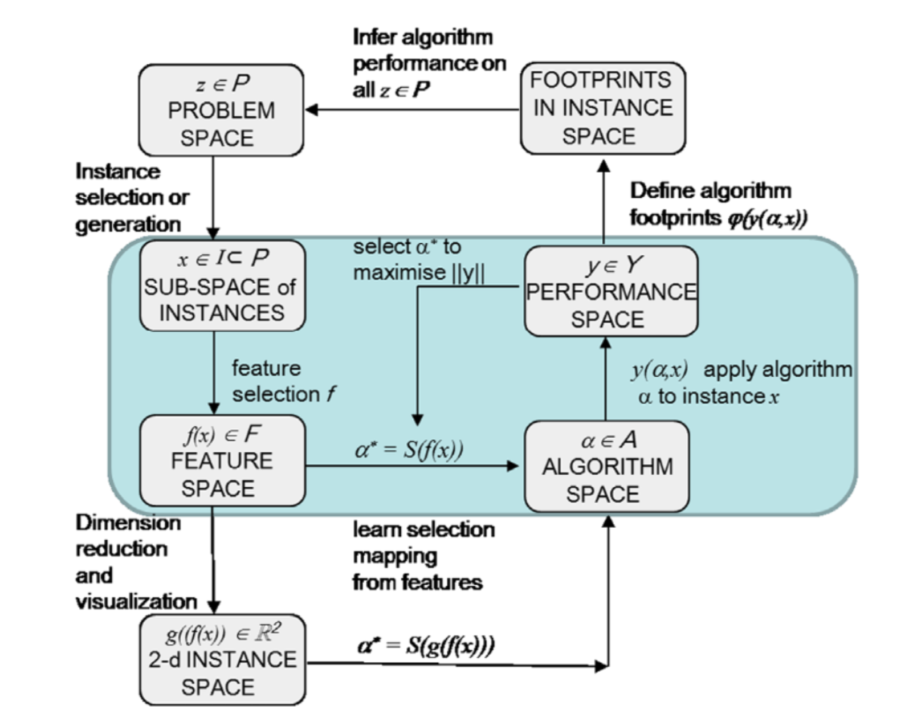
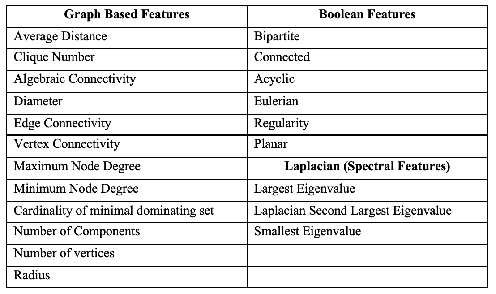
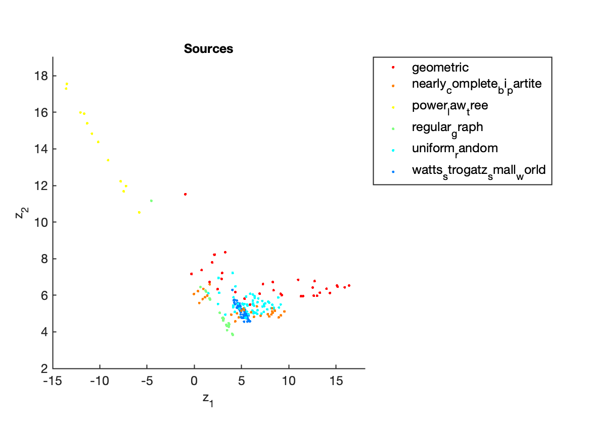
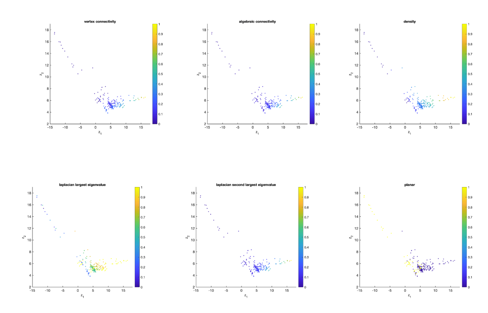
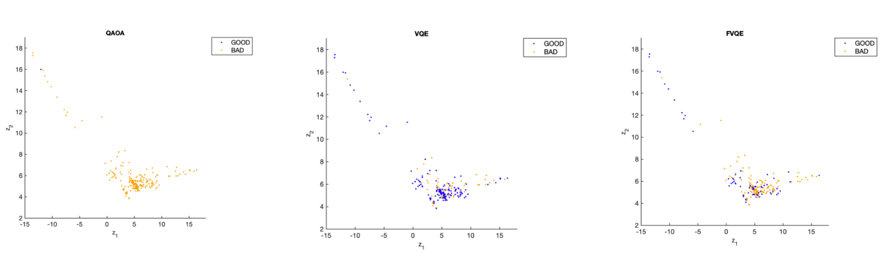

# Introduction
## Background
  - Developing a framework to robustly evaluate quantum algorithms using Instance Space Analysis
  - Explore the tools needed to develop Quantum Algorithms:
      - Adiabatic  Quantum Algorithms (year 1)
      - Universal Gate Based Quantum Algorithms (year 2)
      - Explore various optimisation problems, initialisation techniques and instance classes

## Agenda
>- Explore the Optimisation Problems
>- Quantum Algorithms
>- Methodology
>- Results
>- Next Steps
>- Research Plan

## Optimisation Problems

- Traveling Salesperson Problem (TSP) and Vehicle Routing (VRP)
- MAXCUT
- 3SAT - Exact Cover


# The Traveling Salesman Problem (TSP)

>- The Traveling Salesman Problem (TSP) is a well-known combinatorial optimization problem that involves finding the shortest possible route that visits a given set of cities exactly once and returns to the starting city.

>- Let $C = {c_1, c_2, ..., c_n}$ be a set of cities, where $c_i$ is the i-th city.
>- Let $d(c_i, c_j)$ be a function that calculates the distance between cities $c_i$ and $c_j$.
>- The Traveling Salesman Problem (TSP) is to find a Hamiltonian cycle $\pi = {\pi_1, \pi_2, ..., \pi_n}$ of minimum total length.
>- The cycle $\pi$ must visit each city in the set $C$ exactly once and $\pi_{n+1} = \pi_1$.
>- The TSP can be defined mathematically as:
>- $$
\min_{\pi} \sum_{i=1}^{n} d(c_{\pi_i}, c_{\pi_{i+1}})
$$

## TSP Example


## TSP mapping to QUBO
>- Represent cities as binary variables: 
>   - Assign a binary variable $x_{i,t}$ to represent which the city visited at timestep $t$
>   - We can now represent the cost as a function of the decision variables:
>   - $$
    \text{Cost} = \sum_{t}\sum_{i,j \in C} d(i,j) x_{i,t}x_{j,t+1}
$$

>- **Constraints:** 
>   - Each city must be visited: $\sum_{j=1}^{n} x_{ij} = 1$ for all $i \in {1,2,\cdots,n}$.
>   - Each city must be reached from exactly one city: $\sum_{i=1}^{n} x_{ij} = 1$ for all $j \in {1,2,\cdots,n}$.
>   - No two cities can be visited at the same time: $x_{ij} + x_{ji} \le 1$ for all $i,j \in {1,2,\cdots,n}$.
>   - To convert this problem to a QUBO express constraints as penalty terms in the objective function. 

## TSP mapping to QUBO

>- First constraint can be expressed as $P_1 \left(\sum_{j=1}^{n} x_{ij} - 1\right)^2$, where $P_1$ is a large positive constant. 
>- Similarly, the other constraints can be expressed as penalty terms in the objective function. 
>- The final objective function becomes a QUBO of the form: $P_1 \left(\sum_{j=1}^{n} x_{ij} - 1\right)^2 + P_2 \left(\sum_{i=1}^{n} x_{ij} - 1\right)^2 + \sum_{i=1}^{n} \sum_{j=1}^{n} P_3(x_{ij} + x_{ji} - 1)^2 + \sum_{i=1}^{n} \sum_{j=1}^{n} d_{ij}x_{ij}$.
>- To simplify, we can also have $A = P_1 = P_2 = P_3$
>- This QUBO can then solved by a quantum algorithm

## TSP mapping to QUBO

Assign a qubit to each decision variable, make a the following substitution
$$x_{l,t}=\frac{(I-Z_{l,t})}{2}.$$

## Extending TSP to VRP

>- If we have $N$ vehicles. Implement spectral clustering create $N$ cluster.
>- Solve each cluster independently.
>- 


# MAXCUT

## MAXCUT 

>- Given a graph $G = (V, E)$ with vertices $V$ and edges $E$.
>- Each edge $(i, j) \in E$ has a weight $w(i, j)$.
>- Partition the vertices into two disjoint sets $S$ and $T$, such that $S \cup T = V$ and $S \cap T = \emptyset$.
>   - Assign a binary variable $x_{i,t}$ to represent which the city visited at timestep $t$
>   - Our goal is to find a partition that maximizes the MAXCUT value:
>   - $$C(\textbf{x}) = \sum_{i,j} w_{i, j} \enspace x_i(1-x_j)$$

>- This problem is NP-hard [@Karp1972]

## MAXCUT Formulation


**Solution:** Two partitions are $S = \{1, 2\}$ and $T = \{2, 4, 5\}$. The size of the cut is 5.

## Mapping MAXCUT to QUBO

>- To solve this problem on a Quantum Computer we need to map it to a QUBO.
>- Similar to the TSP we can assign a qubit to each decision variable, make a the following substitution
>    - $$x_{i}=\frac{(I-Z_{i})}{2}.$$

# 3SAT - Exact Cover

## 3SAT (Exact Cover)

>- The satisfiability problem, abbreviated SAT, is a classic example of an NP-complete problem [@Cook1971]
>- The basic SAT formulation can be described as follows: Given a boolean formula (AND $\land$, OR $\lor$ , NOT $\neg$) over $n$ variables ($z_1, z_2, ... , z_n$). Can one set $z_i$'s in a manner such that the Boolean formula is true?
>- A clause is an expression which the variables must satisfy. For example $z_1 \land z_2 \implies z_1 = z_2 = 1$


## 3SAT (Exact Cover Example)

>- Consider a 4-bit number with two clauses:
>    - $z_1 \land z_2  \land z_3$
>    - $z_1 \land z_3  \land z_4$
>- Here we have 16 possible assignments, namely:
>- \begin{align*}
  \mathcal{Z} = \{\,
  & 0000, 0001, 0010, 0011, 0100, 0101, 0110, 0111, \\
  & 1000, 1001, 1010, 1011, 1100, 1101, 1110, 1111 \,\}\enspace
\end{align*}

>- However, our **satisfying assignment** is only $\vec{z} = 1111$
>- We call a 3SAT problem with one satisfying assignment an instance of USA
>- Exact Cover implies that clauses are "exclusive" and in the form of $z_i + z_j + z_k = 1$

## Mapping 3SAT to a Hamiltonian

>- How do we construct $H_B$ and $H_P$ so that we can solve our optimisation problem?
>- Farhi et al.[@Farhi2001] describe this construction in considerable detail.
>- We then evolve our system with the following interpolation:
>- $$
    H(t) = \left[1 - \lambda(t)\right]H_B + \lambda(t)H_P, \qquad \lambda (t) = \frac{t}{T}
$$
>- Finally, complete measurement and our solution is our final state $\ket{\psi(t=T)}$


# Quantum Algorithms

## Quantum Algorithms

>- **Adiabatic Quantum Computing**
>   - AQC is a specific type of quantum computing that uses adiabatic evolution to solve optimization problems [@Farhi2001].
>   - AQC relies on the natural evolution of the quantum system, avoiding the need for precise control over individual quantum gates [@Preskill2018].
>- **Gate Based Quantum Computing**
>   - Uses a series of quantum gates to manipulate the quantum system and perform specific computations [@Raussendorf2001].
>   - Requires precise control over individual quantum gates, which can be challenging to implement [@Childs2004].
>   - Potential for faster performance, as it can use advanced techniques such as error correction and quantum parallelism [@Raussendorf2001].


## Quantum Algorithms

\begin{table}[]
\begin{tabular}{ll}
\hline
\multicolumn{1}{|l|}{Quantum Algorithm} & \multicolumn{1}{l|}{**Optimisation Problem} \\ \hline
AQC                                         & 3SAT                                          \\ \hline
QAOA                                        & MAXCUT                                        \\
                                            & TSP                                           \\ \hline
VQE                                         & MAXCUT                                        \\
                                            & TSP                                           \\ \hline
F-VQE                                       & MAXCUT                                        \\
                                            & TSP                                          
\end{tabular}
\end{table}


## Types of instances investigated (MAXCUT only)

- Regular Graphs
- Unifrom Random Graphs
- Watts-Strotgatz Small World
- Nearly Complete Bipartite Graphs
- Power Law Tree Graphs
- Nearly Complete Bipartite Graphs
- Geometric Graphs

## Classical Optimisers Explored

- SPSA, COBYLA, NELDER_MEAD
- 

## Initialisation Techniques Explored (QAOA)
- Random Initialisation
- Perturb from previous layer
- Ramped up Initalisation
- Fourier Transform
- Trotterized Quantum Annelaing

# Instance Space Analysis

## Algorithm Selection

>- Given a set of problem instances, predicting which algorithm is most likely to best perform was first explored by Rice [@Rice1976].
\pause
```{r echo=FALSE, out.width='60%', fig.align='center'}
knitr::include_graphics('images/rices-framework-for-algorithm-selection.png')
```
>- However, what we are interested in is probing the strengths and weaknesses of AQC for different instances of SAT.

## Instance Space Methodology

>- The instance space methodology presented in [@Smith-Miles2015; @Smith-Miles2012; @Smith-Miles2014] extends Rice's framework.
\pause
```{r echo=FALSE, out.width='60%', fig.align='center'}

```


## Instance Space 

>- The problem space $\mathcal{P}$ consists of all possible graph instances
>- The instance space $\mathcal{I} \subset \mathcal{P}$ compromises of \textbf{867} MAXCUT instances.
>- The feature space $\mathcal{F}$ consists of 21 different instance features generated
>- The algorithm portfolio $\mathcal{A}$  includes $F-VQE$, $VQE$ and $QAOA$
>- The performance metric $y \in \mathcal{Y}$ is the probability of success for the algorithm. 

## Graph Features

21 features were considered


## Sources


## Feature Distribution



## Performance Distribution




 

## Thesis Outline
- [Thesis Structure](#thesis-structure)
  - [Introduction](#introduction)
  - [Solving Optimisation Problems using a Quantum Computer](#solving-optimisation-problems-using-a-quantum-computer)
  - [Features and Algorithm Performance of Quantum Algorithms](#features-and-algorithm-performance-of-quantum-algorithms)
  - [Instance Space Analysis](#instance-space-analysis)
  - [Frameworks for Evaulating Quantum Algorithms / Discussion](#frameworks-for-evaulating-quantum-algorithms--discussion)
  - [Evaulation of Other Optimisation Algorithms](#evaulation-of-other-optimisation-algorithms)
  - [Conclusion](#conclusion)
  
## Discuss thesis outline
- Here is a link to the [thesis outline](https://github.com/vivekkatial/fantastic-enigma/blob/master/thesis/thesis-structure.md)


## Next Steps

- Formalise findings into a paper (currently in progress)
- Solve all existing models on Quantum Hardware
- Investigate generalised Hamiltonian features

## References {.allowframebreaks}

